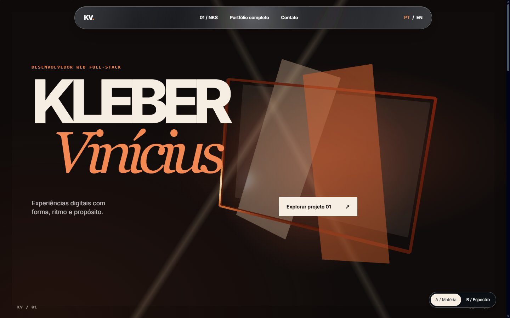
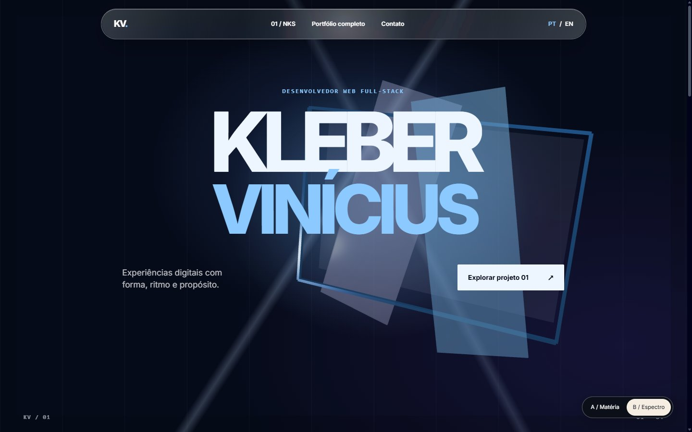
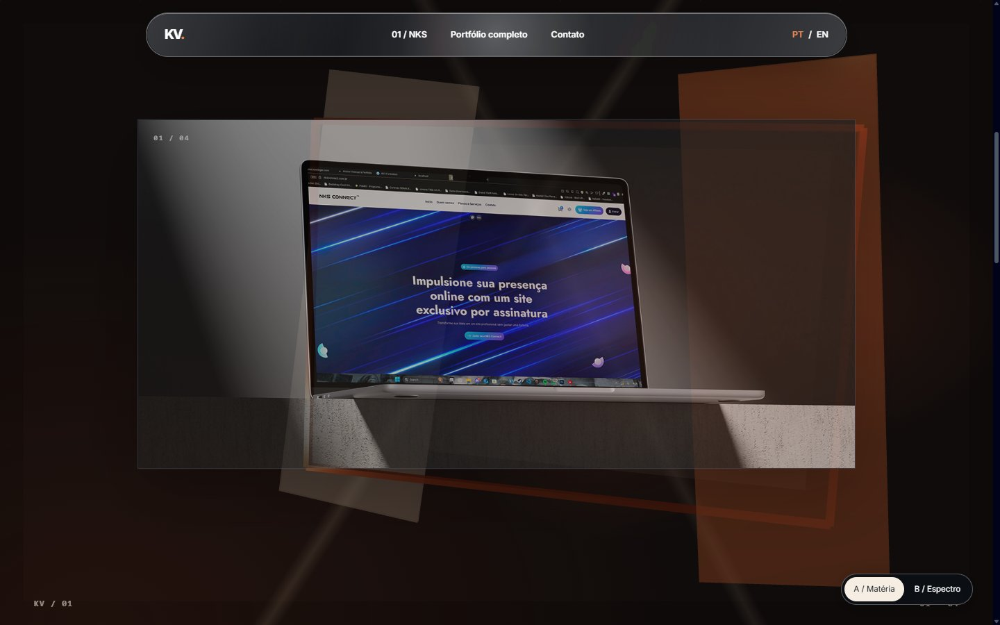
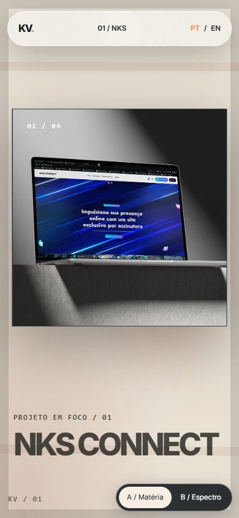

# P2 · Sistemas em travessia — direção e protótipo para o Mastermind

Revisão 2 · 26/09/2026 · Worker · `redesign/awwwards-repagination`.

## Correção de direção

O Mastermind rejeitou **Portfolio Gallery, de Isaiah Bjork**, como referência de composição. A proposta anterior, **Interfaces em órbita**, também foi substituída: o portfólio não deve parecer uma galeria contida ou quatro cartões projetados no espaço. A referência de [Dennis Snellenberg](https://dennissnellenberg.com/) permanece apenas pelo cuidado com tipografia, ritmo, interação e transições; seu layout, código e mídia não são modelo a reproduzir. A busca real do MCP 21st.dev continua registrada no gate P0, mas nenhum componente pesquisado determina o layout.

**Design Read (Taste):** portfólio autoral de desenvolvedor web full-stack para clientes, equipes e recrutadores, com linguagem cinematográfica/editorial e evidência concreta de trabalho. Dials de projeto: `DESIGN_VARIANCE=9`, `MOTION_INTENSITY=9`, `VISUAL_DENSITY=4`. A composição principal é imersiva; os fallbacks preservam conteúdo e operação.

**Tese — Sistemas em travessia.** Uma estrutura óptica e arquitetônica atravessa a página, transforma-se ao encontrar cada projeto e muda o modo de enquadrar sua mídia real. O scroll conduz cortes, aproximações e pausas; cada case ganha um capítulo próprio com contribuição já publicada e link. A cena 3D é a costura entre capítulos, não a apresentação dos projetos como cartões. A página começa escura, abre a imagem de NKS Connect em escala de cinema e alterna matéria, temperatura e ritmo conforme a obra seguinte. A tipografia faz parte da montagem, sem depender de animação para ser lida.

## Dois styleframes implementados

Ambos são capturas da rota funcional em 1440×900, no primeiro quadro. Servem à escolha da linguagem visual; nenhum deles é um template importado.

| Direção | Intenção | Captura |
| --- | --- | --- |
| **A / Matéria** | Carbono e cobre, grande nome assimétrico com segunda linha em serifa; luz quente atravessa uma estrutura de planos. A passagem chega a papel claro e mantém a mídia NKS como foco. |  |
| **B / Espectro** | Azul noturno e luz óptica fria; nome central em grotesca de escala monumental, geometria mais nítida e fechamento sobre azul pálido. |  |

Rotas locais da revisão: `/pt-br/awwwards-preview/ember`, `/pt-br/awwwards-preview/spectral`, `/en/awwwards-preview/ember` e `/en/awwwards-preview/spectral`. As rotas originais `/pt-br` e `/en` continuam disponíveis. A prévia tem `noindex` e seletor A/B próprio. Fontes do site existente e mídia do repositório são usadas nesta etapa; a escolha tipográfica final depende da revisão dos styleframes. Não há asset externo novo.

## Storyboard de ponta a ponta

| Capítulo | Quadro e conteúdo real | Câmera, cena e corte | Entrada/saída e interação |
| --- | --- | --- | --- |
| **Abertura** | Nome KV, função provisória aprovada e CTA no primeiro quadro. Uma abertura arquitetônica com duas lâminas translúcidas ocupa a profundidade. | Câmera oblíqua aproxima e gira até o eixo frontal; as lâminas se afastam para revelar a abertura. | ScrollTrigger dissolve o título só quando a mídia seguinte ganha presença. O CTA leva ao case também sem JS. Ponteiro desloca apenas a luz da navbar; teclado recebe foco estável. |
| **01 · NKS Connect** | Mockup já publicado, título, descrição existente de plataforma de sites por assinatura e link real. | A abertura se achata em uma tela; a câmera avança enquanto o mockup HTML cresce e substitui o vazio. A estrutura recua em opacidade. | No protótipo, imagem entra ainda sobre fundo escuro; o corte para papel claro ocorre depois que ela é reconhecível. Scroll reverso remonta o hero. Conteúdo completo permanece após a sequência sticky. |
| **02 · Milan Móveis** | Mídia e texto existentes do site para varejo de móveis; contribuição só nos termos já publicados. | Em futura expansão, câmera faz travessia lateral sem reset para o zero; planos ganham luz material mais quente, derivada da mídia real. | A tela NKS sai lateralmente; a nova mídia ocupa o enquadramento antes do título. Sem textura de madeira fictícia ou números inventados. |
| **03 · Sincad-MT** | Mídia e texto existentes do site do sindicato. | Movimento desacelera e a câmera se torna frontal; linhas estruturais se alinham para uma leitura mais institucional. | Corte mais sóbrio, com metadados claros e sem selos, métricas ou autorização pública presumida. |
| **04 · Criactive Design** | Mídia e texto existentes do site da agência. | A estrutura abre novamente em profundidade; a câmera passa entre dois planos e entrega a imagem final. | A energia aumenta sem converter a seção em grade de miniaturas; o link real encerra a série. |
| **Sobre / trajetória** | Colaboração, stack e marcos já publicados, revistos quanto a fatos pendentes D01–D05. | A câmera recua; a estrutura deixa de ser moldura de mídia e vira linha de tempo espacial discreta. | ScrollTrigger alterna escala de leitura, nunca a disponibilidade de texto. Foco/âncoras chegam ao conteúdo sem efeito obrigatório. |
| **Depoimentos** | Três depoimentos preservados com retrato, nome, atribuição e controle de pausa. | Câmera quase imóvel; a cena segura a atenção na voz e não compete com ela. | Framer Motion controla apenas a troca local já existente; autoplay pausável por botão, hover e foco. Reduzido movimento mostra citação estática. |
| **Processo** | Três etapas existentes sempre legíveis. | A câmera percorre três juntas da estrutura, sem shader sobre o texto. | Transições marcam explicação, não descoberta de conteúdo; touch e teclado não dependem de hover. |
| **Contato** | E-mail e redes atuais; CTA direto. | Plano final recua para sugerir KV na geometria e encerra o movimento. | Scroll termina em quadro estável; links e foco permanecem sem deslocamento. |

Os capítulos 02–contato são storyboard, não implementação declarada. A revisão visual do Mastermind acontece antes de multiplicar o sistema do protótipo.

## Responsabilidade de cada sistema

| Sistema | Responsabilidade exclusiva | O que não controla | Vida útil |
| --- | --- | --- | --- |
| **Lenis** | Suavizar wheel e sincronizar âncoras no desktop; fornecer posição de scroll a ScrollTrigger. Touch mantém arraste natural. | Transform/opacity de DOM, câmera ou gestos locais. | Um Lenis na rota de prévia, `autoRaf:false`, alimentado pelo ticker GSAP; `destroy()` na saída; ignorado sob reduced motion. |
| **GSAP + ScrollTrigger** | Uma timeline scrub da passagem hero → NKS: opacidade/translate do título, escala/entrada da mídia, cor do fundo e progresso normalizado. Nas futuras seções, timelines de capítulo com dono único dos elementos DOM. | Transform de malhas Three, press/hover de controles, render loop. | `gsap.context().revert()` e triggers removidos no unmount; `refresh()` após fontes/imagem; ticker desconectado em aba oculta. |
| **Three.js / R3F** | Câmera e malhas da estrutura 3D, lendo o progresso normalizado entregue por GSAP. | Scroll, DOM, links ou conteúdo editorial. | `frameloop="demand"`; só invalida após mudança de progresso; DPR 1–1,5; canvas desmontado em perda de contexto, indisponibilidade ou reduced motion. |
| **Framer Motion** | Press do CTA e hover do link do case no protótipo; depois, gestos locais e trocas do carrossel. | Scrolltelling, câmera ou elementos controlados por GSAP. | Elementos React desmontam sem ticker global; teclado usa foco e ativação nativos sem coreografia de press. |
| **CSS** | Foco, layout responsivo, cor e estado do vidro; poster de reserva. | Progressão de capítulo. | Sem loop; `prefers-reduced-motion` e `prefers-reduced-transparency` preservam legibilidade. |

A ligação Lenis/GSAP segue a [integração oficial do Lenis](https://github.com/darkroomengineering/lenis#gsap-scrolltrigger). O `onUpdate` foi colocado na timeline, conforme a [orientação de ScrollTrigger para scrub numérico](https://gsap.com/docs/v3/Plugins/ScrollTrigger/), para manter DOM e cena no mesmo progresso. A cena usa renderização sob demanda. Só um motor suaviza scroll; nenhum sistema disputa `transform` ou `opacity` do mesmo elemento.

## Matriz de interação e interrupção

| Ação | Função e gatilho | Controlador / propriedades | Término, reversão e fallback |
| --- | --- | --- | --- |
| Abertura → NKS | Explicar relação entre estrutura e obra ao rolar. | ScrollTrigger: transform/opacity de hero e mídia, background do stage; Three: câmera/rotação/escala de malhas. | Scrub segue scroll em ambos os sentidos; interrupção para onde o usuário parou. Sob reduced motion, hero e case aparecem em fluxo estático. |
| Suavização | Tornar a progressão contínua no wheel. | Lenis: somente posição de scroll; GSAP ticker fornece um único relógio. | Pode parar em qualquer ponto; aba oculta remove ticker; touch não usa inércia artificial; sob reduced motion Lenis não é criado. |
| Reação da navbar | Comunicar profundidade e presença sem perturbar links. | CSS `backdrop-filter`/filtro SVG na camada óptica; ponteiro atualiza posição da luz em um RAF solicitado por evento. | Pointer leave congela a luz sem loop; teclado não move a lente; fundo sólido em transparência reduzida ou filtro indisponível. O texto e o foco ficam fora da distorção. |
| CTA e link do case | Feedback de gesto local. | Framer Motion: `scale` do CTA em pointer/touch press, `translateY` do link em hover fino. | Pointer up/cancel/leave retorna ao estado inicial; ativação por teclado é imediata e mantém foco visível; reduced motion remove o gesto. |
| Troca de idioma / direção | Navegar para estado equivalente. | Links HTML PT/EN e A/B; navegador/Next. | Sem transição que bloqueie a navegação; a URL retém o styleframe escolhido ao trocar idioma. |
| Perda de WebGL | Manter a história operável. | React desmonta Canvas; CSS oferece poster; GSAP continua a transição da mídia HTML. | Context loss cancela a cena; mídia, link, navbar e scroll continuam presentes. |

## Vidro, mídia e direitos

A cápsula da prévia tem preenchimento semitransparente, `backdrop-filter` com blur e deslocamento SVG onde suportado, realce que acompanha ponteiro fino e cor de texto que muda quando o stage clareia. Trata-se de **aproximação web**, não de Liquid Glass nativo da Apple. O efeito fica atrás de links/foco e tem fallback sólido para Safari/iOS ou preferência de transparência reduzida. A validação visual em Safari real e sobre todas as mídias ainda pertence ao gate P2.

O protótipo usa `public/LaptopMockup.svg` do NKS Connect já presente no portfólio. Sua procedência anterior ao repositório continua a ser auditada antes de criar derivados novos. Capturas de referências 21st.dev, Dennis, Rockstar, Lando Norris ou Apple não foram usadas como mídia, código, marca ou layout. Outros cases manterão as mídias existentes até confirmação do proprietário; nada no storyboard autoriza nova métrica, depoimento, vínculo ou divulgação institucional.

## Evidência e gate desta revisão

No protótipo, PT/EN têm título, case, link e idioma inicial próprios; HTML servido contém um `h1`, descrição e link NKS sem executar JS. Chrome DevTools MCP mostrou Canvas ativo no modo normal; emulação de WebGL indisponível mostrou zero Canvas, poster e mídia do case; emulação de reduced motion mostrou zero Canvas, sequência estática e conteúdo acessível. Essas são emulações de navegador, não teste físico de Safari/iOS. Capturas são da prévia local. O site principal permanece como na P1.

**Gate:** direção reformulada e primeiro corte hero → case implementado para revisão. A escolha A/B, refinamento do vidro, os outros três cases e as seções seguintes aguardam avaliação visual do Mastermind. P2 integral, P3 e P4 continuam abertos.
