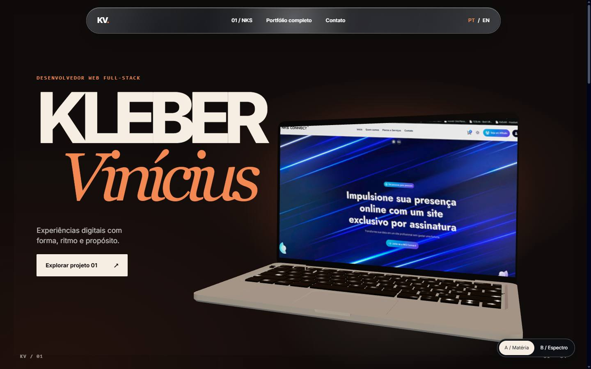
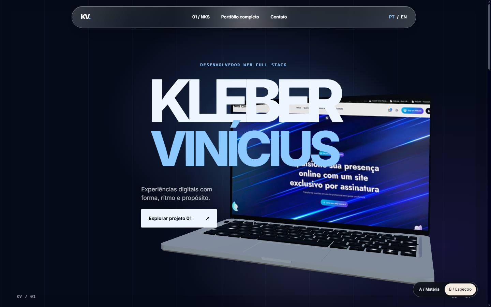
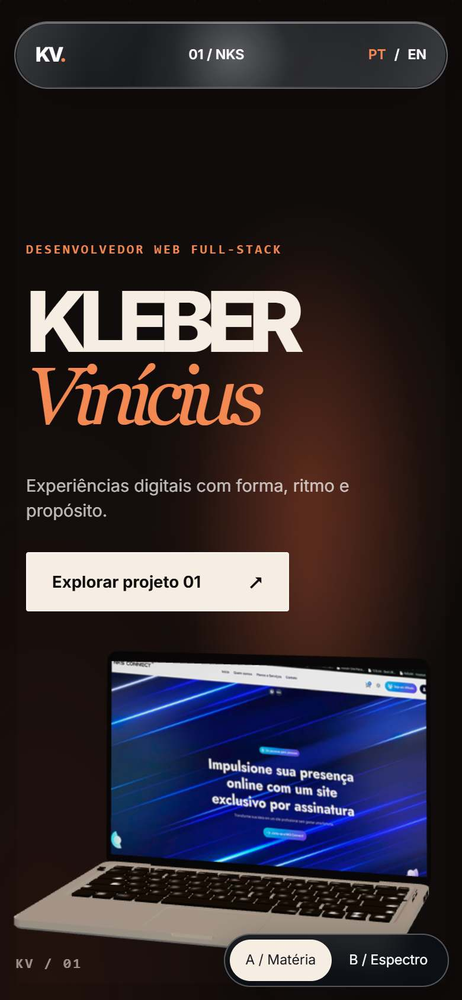
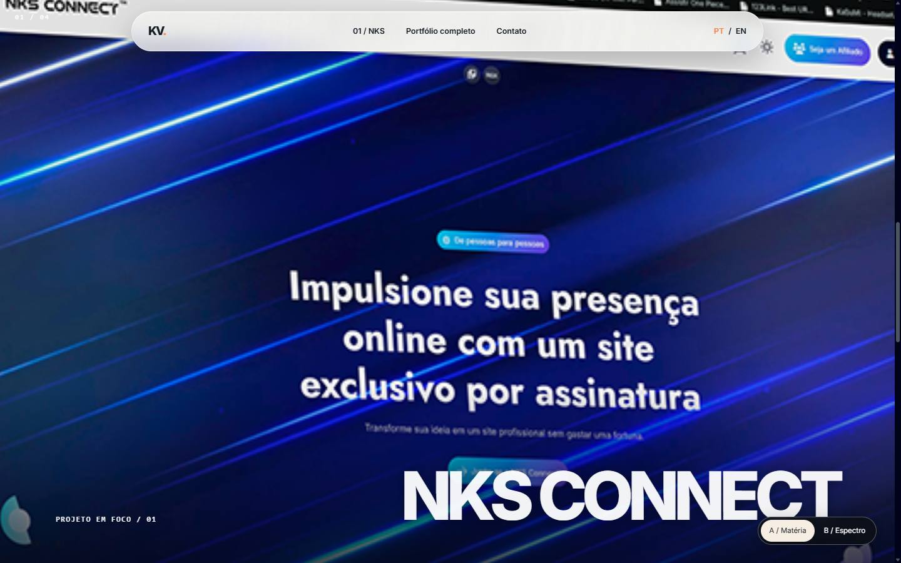
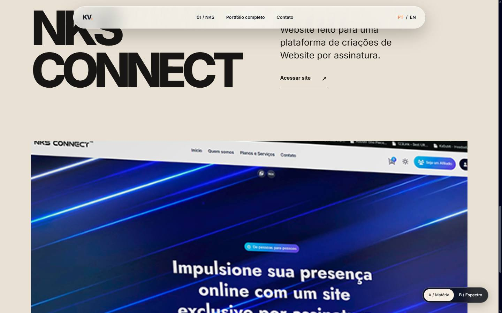
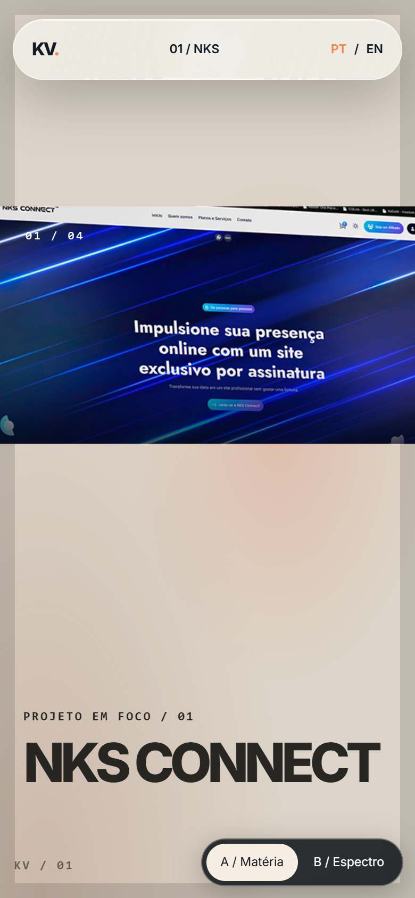
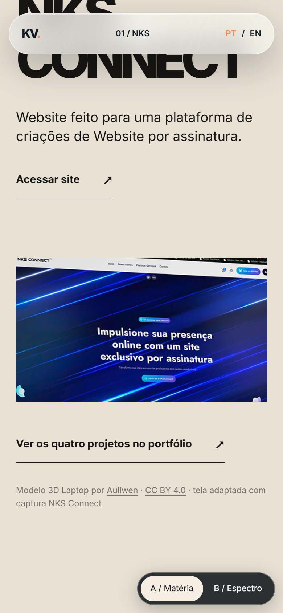
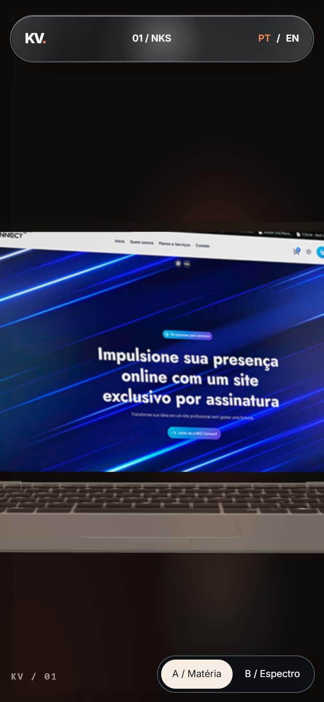
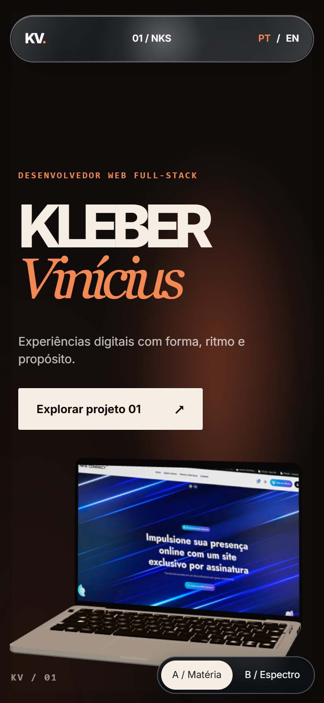

# P2 · Sistemas em travessia — direção e protótipo para o Mastermind

Revisão 3 · 27/09/2026 · Worker · `redesign/awwwards-repagination` · corte para decisão visual, sem conclusão da P2.

## Correção de direção

O Mastermind rejeitou **Portfolio Gallery, de Isaiah Bjork**, como referência de composição. A proposta anterior, **Interfaces em órbita**, também foi substituída: o portfólio não deve parecer uma galeria contida ou quatro cartões projetados no espaço. A referência de [Dennis Snellenberg](https://dennissnellenberg.com/) permanece apenas pelo cuidado com tipografia, ritmo, interação e transições; seu layout, código e mídia não são modelo a reproduzir. A busca real do MCP 21st.dev continua registrada no gate P0, mas nenhum componente pesquisado determina o layout.

**Design Read (Taste):** portfólio autoral de desenvolvedor web full-stack para clientes, equipes e recrutadores, com linguagem cinematográfica/editorial e evidência concreta de trabalho. Dials de projeto: `DESIGN_VARIANCE=9`, `MOTION_INTENSITY=9`, `VISUAL_DENSITY=4`. A composição principal é imersiva; os fallbacks preservam conteúdo e operação.

**Tese — Sistemas em travessia.** O objeto real fornecido pelo proprietário abre a narrativa. A câmera parte do notebook NKS, aproxima-se de sua tela e entrega a imagem ao conteúdo HTML do case enquanto o chassi se dissolve. O scroll pode voltar e reconstruir a máquina. Cada obra seguinte deve transformar a cena segundo sua própria mídia e contribuição publicada, sem virar cartão de um template espacial. A página começa em A / Matéria: carbono, cobre e luz quente; papel claro aparece somente depois que NKS domina o quadro. A tipografia faz parte da montagem, sem depender de animação para ser lida.

## Dois styleframes implementados

Ambos são capturas da rota funcional com o mesmo GLB real em 1440×900. A é o ponto de partida escolhido pelo proprietário; B permanece como comparação de cor e composição, sem adoção. Nenhum é um template importado. As capturas anteriores em `styleframes/` documentam a revisão 2 e foram superadas pelo modelo atual.

| Direção | Intenção | Captura |
| --- | --- | --- |
| **A / Matéria** | Carbono e cobre, nome assimétrico com segunda linha em serifa; notebook real com NKS na tela e luz quente. |  |
| **B / Espectro** | Azul noturno e luz fria sobre o mesmo notebook. O choque do título central com a máquina é motivo para não consolidá-la. |  |

Rotas locais da revisão: `/pt-br/awwwards-preview/ember`, `/pt-br/awwwards-preview/spectral`, `/en/awwwards-preview/ember` e `/en/awwwards-preview/spectral`. As rotas originais `/pt-br` e `/en` continuam disponíveis. A prévia tem `noindex` e seletor A/B próprio. O GLB é o arquivo fornecido pelo proprietário, copiado sem alteração de bytes; a tela usa a captura NKS já embutida em `public/LaptopMockup.svg`, extraída sem alterar seus pixels. Não há mídia externa inventada.

## Storyboard de ponta a ponta

| Capítulo | Quadro e conteúdo real | Câmera, cena e corte | Entrada/saída e interação |
| --- | --- | --- | --- |
| **Abertura** | Nome KV, função já publicada, CTA e notebook do proprietário no primeiro quadro. X e wireframe foram removidos. | Câmera oblíqua mostra teclado, chassi e NKS na tela; aproxima e gira até o eixo frontal. | ScrollTrigger dissolve o título antes da tela dominar. O CTA leva ao case também sem JS. Ponteiro desloca apenas a luz da navbar; teclado recebe foco estável. |
| **01 · NKS Connect** | Captura histórica verdadeira da mídia NKS, título, descrição existente de plataforma de sites por assinatura e link publicado. | A câmera avança para a malha `Screen`; `Frame` e casca de `Screen` perdem opacidade, a mídia na tela persiste até a entrega ao mesmo recorte em HTML. | A mídia HTML assume o quadro, seguida de fundo de papel e conteúdo editorial. Scroll reverso remonta tela, chassi e hero. Conteúdo completo permanece após a sequência sticky. |
| **02 · Milan Móveis** | Mídia e texto existentes do site para varejo de móveis; contribuição só nos termos já publicados. | Em futura expansão, câmera faz travessia lateral sem reset para o zero; planos ganham luz material mais quente, derivada da mídia real. | A tela NKS sai lateralmente; a nova mídia ocupa o enquadramento antes do título. Sem textura de madeira fictícia ou números inventados. |
| **03 · Sincad-MT** | Mídia e texto existentes do site do sindicato. | Movimento desacelera e a câmera se torna frontal; linhas estruturais se alinham para uma leitura mais institucional. | Corte mais sóbrio, com metadados claros e sem selos, métricas ou autorização pública presumida. |
| **04 · Criactive Design** | Mídia e texto existentes do site da agência. | A estrutura abre novamente em profundidade; a câmera passa entre dois planos e entrega a imagem final. | A energia aumenta sem converter a seção em grade de miniaturas; o link real encerra a série. |
| **Sobre / trajetória** | Colaboração, stack e marcos já publicados, revistos quanto a fatos pendentes D01–D05. | A câmera recua; a estrutura deixa de ser moldura de mídia e vira linha de tempo espacial discreta. | ScrollTrigger alterna escala de leitura, nunca a disponibilidade de texto. Foco/âncoras chegam ao conteúdo sem efeito obrigatório. |
| **Depoimentos** | Três depoimentos preservados com retrato, nome, atribuição e controle de pausa. | Câmera quase imóvel; a cena segura a atenção na voz e não compete com ela. | Framer Motion controla apenas a troca local já existente; autoplay pausável por botão, hover e foco. Reduzido movimento mostra citação estática. |
| **Processo** | Três etapas existentes sempre legíveis. | A câmera percorre três juntas da estrutura, sem shader sobre o texto. | Transições marcam explicação, não descoberta de conteúdo; touch e teclado não dependem de hover. |
| **Contato** | E-mail e redes atuais; CTA direto. | Plano final recua para sugerir KV na geometria e encerra o movimento. | Scroll termina em quadro estável; links e foco permanecem sem deslocamento. |

Os capítulos 02–contato são storyboard, não implementação declarada. A revisão visual do Mastermind acontece antes de multiplicar o sistema do protótipo.

## Responsabilidade de cada sistema

| Sistema | Responsabilidade exclusiva | O que não controla | Vida útil |
| --- | --- | --- | --- |
| **Lenis** | Suavizar wheel e sincronizar âncoras no desktop; fornecer posição de scroll a ScrollTrigger. Touch mantém arraste natural. | Transform/opacity de DOM, câmera ou gestos locais. | Um Lenis na rota de prévia, `autoRaf:false`, alimentado pelo ticker GSAP; `destroy()` na saída; ignorado sob reduced motion. |
| **GSAP + ScrollTrigger** | Uma timeline scrub da passagem hero → NKS: opacidade/translate do título, escala/entrada da mídia, cor do fundo e progresso normalizado. Nas futuras seções, timelines de capítulo com dono único dos elementos DOM. | Transform de malhas Three, press/hover de controles, render loop. | `gsap.context().revert()` e triggers removidos no unmount; `refresh()` após fontes/imagem; ticker desconectado em aba oculta. |
| **Three.js / R3F** | Câmera e malhas `Frame`/`Screen` do GLB, lendo o progresso normalizado entregue por GSAP. | Scroll, DOM, links ou conteúdo editorial. | `frameloop="demand"`; só invalida após mudança de progresso; DPR 1–1,5; canvas desmontado em perda de contexto, indisponibilidade ou reduced motion. Materiais dinâmicos e plano da mídia são descartados no unmount. |
| **Framer Motion** | Press do CTA e hover do link do case no protótipo; depois, gestos locais e trocas do carrossel. | Scrolltelling, câmera ou elementos controlados por GSAP. | Elementos React desmontam sem ticker global; teclado usa foco e ativação nativos sem coreografia de press. |
| **CSS** | Foco, layout responsivo, cor e estado do vidro; poster de reserva. | Progressão de capítulo. | Sem loop; `prefers-reduced-motion` e `prefers-reduced-transparency` preservam legibilidade. |

A ligação Lenis/GSAP segue a [integração oficial do Lenis](https://github.com/darkroomengineering/lenis#gsap-scrolltrigger). O `onUpdate` da timeline entrega o mesmo progresso ao DOM e à cena. A cena usa renderização sob demanda. Só um motor suaviza scroll; nenhum sistema disputa `transform` ou `opacity` do mesmo elemento. O ticker global de GSAP não tem configuração de lag alterada por esta rota.

## Matriz de interação e interrupção

| Ação | Função e gatilho | Controlador / propriedades | Término, reversão e fallback |
| --- | --- | --- | --- |
| Abertura → NKS | Explicar relação entre estrutura e obra ao rolar. | ScrollTrigger: transform/opacity de hero e mídia, background do stage; Three: câmera/rotação/escala de malhas. | Scrub segue scroll em ambos os sentidos; interrupção para onde o usuário parou. Sob reduced motion, hero e case aparecem em fluxo estático. |
| Suavização | Tornar a progressão contínua no wheel. | Lenis: somente posição de scroll; GSAP ticker fornece um único relógio. | Pode parar em qualquer ponto; aba oculta remove ticker; touch não usa inércia artificial; sob reduced motion Lenis não é criado. |
| Reação da navbar | Comunicar profundidade e presença sem perturbar links. | CSS `backdrop-filter`/filtro SVG na camada óptica; ponteiro atualiza posição da luz em um RAF solicitado por evento. | Pointer leave congela a luz sem loop; teclado não move a lente; fundo sólido em transparência reduzida ou filtro indisponível. O texto e o foco ficam fora da distorção. |
| CTA e link do case | Feedback de gesto local. | Framer Motion: `scale` do CTA em pointer/touch press, `translateY` do link em hover fino. | Pointer up/cancel/leave retorna ao estado inicial; ativação por teclado é imediata e mantém foco visível; reduced motion remove o gesto. |
| Troca de idioma / direção | Navegar para estado equivalente. | Links HTML PT/EN e A/B; navegador/Next. | Sem transição que bloqueie a navegação; a URL retém o styleframe escolhido ao trocar idioma. |
| Perda de WebGL | Manter a história operável. | React desmonta Canvas; CSS oferece poster; GSAP continua a transição da mídia HTML. | Context loss cancela a cena; mídia, link, navbar e scroll continuam presentes. |

## Vidro, mídia e direitos

A cápsula da prévia tem preenchimento semitransparente, `backdrop-filter` com blur e deslocamento SVG onde suportado, realce que acompanha ponteiro fino e cor de texto que muda quando o stage clareia. Trata-se de **aproximação web**, não de Liquid Glass nativo da Apple. O efeito fica atrás de links/foco e tem fallback sólido para Safari/iOS ou preferência de transparência reduzida. A validação visual em Safari real e sobre todas as mídias ainda pertence ao gate P2.

O protótipo usa `public/awwwards/laptop-aullwen-original.glb`, cópia integral de `laptop (1).glb` fornecido pelo proprietário. O `asset.extras` indica **Laptop**, **Aullwen**, [obra no Sketchfab](https://sketchfab.com/3d-models/laptop-7d870e900889481395b4a575b9fa8c3e) e [CC BY 4.0](https://creativecommons.org/licenses/by/4.0/). A página Sketchfab retornou 403 nesta sessão; a procedência externa deve ser confirmada antes de publicar. O crédito visível da prévia informa autor, obra, licença e adaptação da tela. A mídia NKS foi extraída do PNG embutido em `public/LaptopMockup.svg`; o site `nksconnect.com.br` não resolveu DNS nesta sessão, portanto a captura é histórica, não uma nova captura ao vivo. O recorte útil tem cerca de 525×300 px e fica suave em tela cheia. Capturas de referências 21st.dev, Dennis, Rockstar, Lando Norris ou Apple não foram usadas como mídia, código, marca ou layout. Outros cases manterão suas mídias existentes até confirmação do proprietário; nada no storyboard autoriza nova métrica, depoimento, vínculo ou divulgação institucional.

## Regras 3D aplicadas ao corte

As skills `r3f-best-practices` e `three-best-practices` foram lidas junto dos sete recursos do Orchestrator Pipeline. Aplicação efetiva:

| Área | Regra aplicada e decisão |
| --- | --- |
| GLB e malhas | `useGLTF` com preload na rota dinâmica; cena cacheada clonada por instância; `Frame_ComputerFrame_0` e `Screen_ComputerScreen_0` localizados por nome. `Box3` recentra e normaliza o modelo original. Não se alterou nem reexportou o GLB. |
| Tela | A UV da malha `Screen` faz parte de atlas do modelo e não recebeu a captura diretamente. Um plano local ligado à malha usa recorte NKS em `CanvasTexture`, orientação frontal, `SRGBColorSpace` e `MeshBasicMaterial` para preservar cor e legibilidade. |
| Cena e câmera | `Canvas` usa `frameloop="demand"`, `invalidate()` após progresso GSAP, DPR máximo 1,5, câmera com near/far 0,1/40 e sem controls concorrentes. `useFrame` só muta câmera, grupo e opacidade, sem estado React ou novas alocações por quadro. |
| Materiais e shaders | Materiais do chassi/casca são clonados para controlar opacidade sem afetar cache compartilhado. A mídia usa material simples sem iluminação. Nenhum shader customizado ou pós-processamento foi necessário neste corte; evita-se passe e loop extras. Transparência fica restrita ao intervalo de dissolução. |
| Carregamento e ciclo de vida | `Suspense` mantém HTML e poster enquanto os recursos carregam; `SceneBoundary` cai no fallback se o carregamento falhar. Geometria, textura e materiais criados para a tela são descartados no cleanup; recursos originais de `useGLTF` ficam no cache compartilhado. Perda de contexto WebGL desmonta Canvas e preserva links/HTML. Aba oculta suspende ticker Lenis. |

## Evidência e gate desta revisão

Capturas do build local de produção, rota `/pt-br/awwwards-preview/ember`, código baseado em `df6c622` mais este corte. A validação e o SHA do commit de implementação estão no checkpoint Worker.

| Quadro | Desktop 1440×900 | Mobile 390×844, DPR 2 |
| --- | --- | --- |
| Hero com GLB |  |  |
| Tela legível / chassi dissolvendo |   |  |
| Case e conteúdo |   |   |
| Retorno do scroll | Mesmo progresso da timeline em sentido reverso |   |

A sequência mobile registrada foi `0 → 760 → 1170 → 2180 → 760 → 0` px. No último quadro, `hero.opacity=1`, `scene.opacity=1` e `media.opacity=0`, sem salto visual. PT/EN têm título, case, link e idioma próprios. Chrome DevTools MCP mostrou Canvas ativo no modo normal; emulações de WebGL indisponível e reduced motion mostraram zero Canvas com texto e links operáveis. A extensão `WEBGL_lose_context` desmontou Canvas durante uso. Emulação de toque em 390×844 ativou `01 / NKS`, alterou hash para `#case-01` e rolou até o conteúdo. São emulações de navegador, não teste físico de Safari/iOS. O site principal permanece como na P1.

**Gate:** somente o primeiro corte hero → NKS está implementado para revisão. A escolha artística A, o refinamento do vidro, a mídia de maior resolução para NKS, os outros três cases e as seções seguintes aguardam avaliação visual do Mastermind. P2 integral, P3 e P4 continuam abertos.
