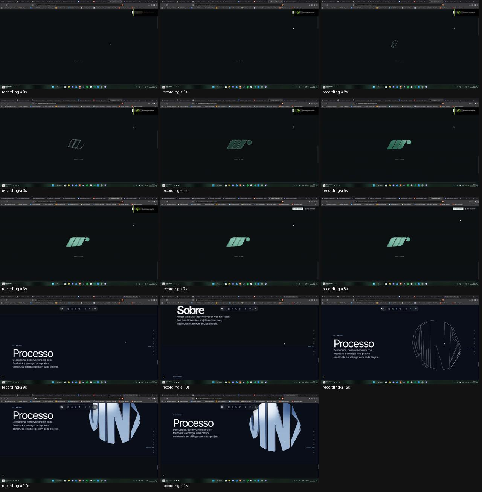
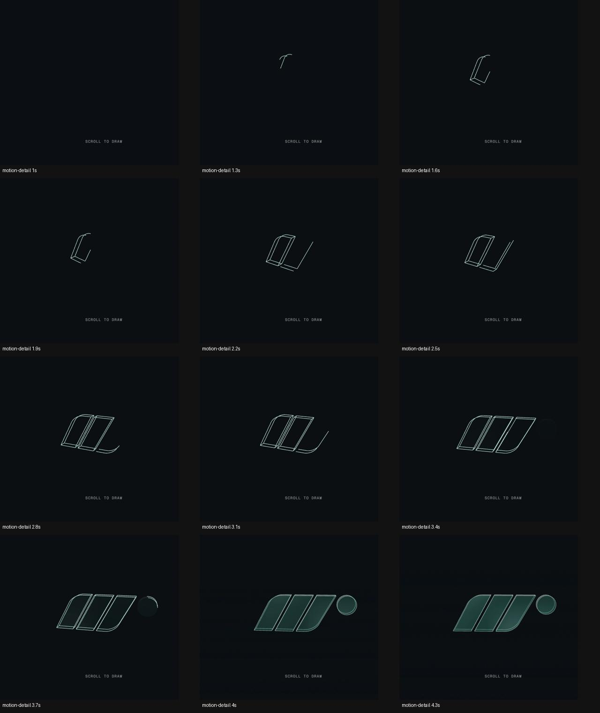
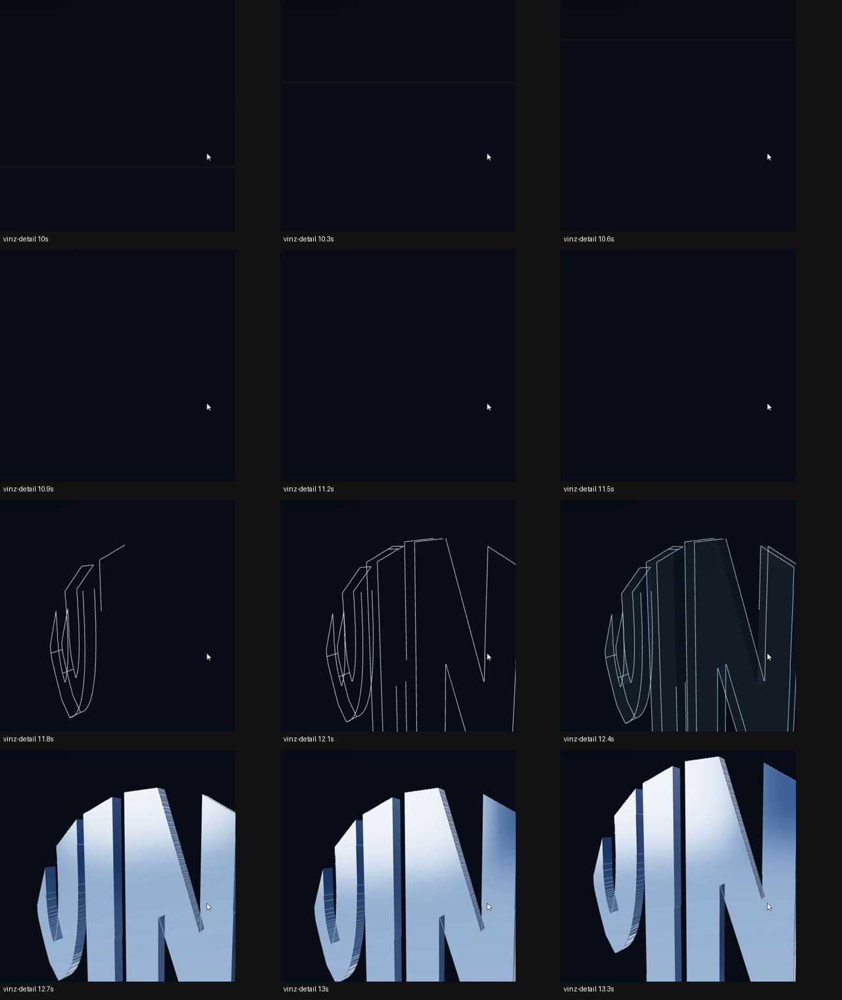

# Evidência Mastermind · construção Processo · 03/10/2026 UTC

Revisão de código/evidência sobre `42d7f6ff81dfbaacf9aa9e9098d88355d9db4dfe`. Não houve implementação de produto nem nova execução da rota completa pelo Mastermind nesta revisão.

## Gravações do proprietário

Originais preservados, não adicionados como novos vídeos grandes ao git. Duração, tamanho e SHA-256 constam em [source-manifest.json](source-manifest.json).

| Arquivo | Conteúdo observado | Uso |
| --- | --- | --- |
| `Desktop 2026.10.02 - 20.27.10.01.mp4` | ~0–8 s: exemplo Motion; ~9–15,59 s: Processo VINZ | Comparação principal |
| `Desktop 2026.10.02 - 20.43.57.02.mp4` | Hero, ponte/SDIMT e reversão; não mostra Processo | Contexto, sem diagnóstico adicional neste incremento |

As folhas de detalhes ampliam recortes de cada gravação; **seus limites de crop não demonstram que a logo está cortada na viewport**. Timestamps identificam quadros, não deltas de wheel. A diferença de duração visível não quantifica a distância de scroll do proprietário. O vídeo contém ambas as composições, mas não usa input instrumentado idêntico.

## Probe isolado de geometria

[geometry-probe.json](geometry-probe.json) registra o resultado. Three `0.177.0`, igual ao lockfile; SVGLoader sobre o SVG atual, Shapes refletidas antes da extrusão, opções exatas do Worker. Reproduzidos os loops de perímetro/conectores e `LineSegments.computeLineDistances()`. Comparação com `EdgesGeometry` threshold 20 sobre a mesma extrusão. DOMParser usado somente no ensaio Node isolado. Pacotes temporários não foram instalados no projeto.

- Wire atual: 2.259 segmentos, distância total 84,20694, finita/monotônica.
- EdgesGeometry cru: 12.181 segmentos, distância total 506,68576. Isto demonstra por que a substituição sem normalização/filtro não é uma recomendação pronta.
- 4 Shapes, 5 contornos com contagens de pontos 255/4/308/23/533. Contagens não constituem autorização para remover um componente ou vazado.

Não houve render GPU neste probe. Ele verifica geometria/distâncias, não enquadramento, cadência visual ou fluidez. O número de descontinuidades entre segmentos indica a ordem de armazenamento; não significa automaticamente linha errada. Não inferir que `computeLineDistances()` reinicia em cada segmento: o código Three efetivamente acumula a distância no buffer não indexado.

## Fontes de medição

- `components/awwwards/identity/ProcessIdentityScene.tsx`, `process-model.ts`, `chapters/ProcessChapter.tsx` e CSS em `story-prototype.module.css`.
- `process-rhythm.json` no relatório Worker: span desktop 990 px; fases do modelo .10–.42 / .38–.62. Cálculos Mastermind: 316,8 px para o desenho, 237,6 px para o material.
- `scripts/check-awwwards-rhythm.mjs`: o PASS anterior verifica chegada/posição/fallback, mas não compara a construção visível das arestas.
- Referência: [Motion oficial](https://motion.dev/examples/js-three-scroll) e fonte completa já arquivada em `reference-sources/electric-identity/Motion-three-scroll.owner-reference.html.txt`. Distância útil de referência calculada a partir do track/sticky, não medida por uma nova navegação nesta revisão.

[Revisão e contrato de correção](../../2026-10-03-PROCESS-DRAW-MASTER-REVIEW.md) · [Prompt Worker](../../2026-10-03-PROCESS-DRAW-WORKER.md).
