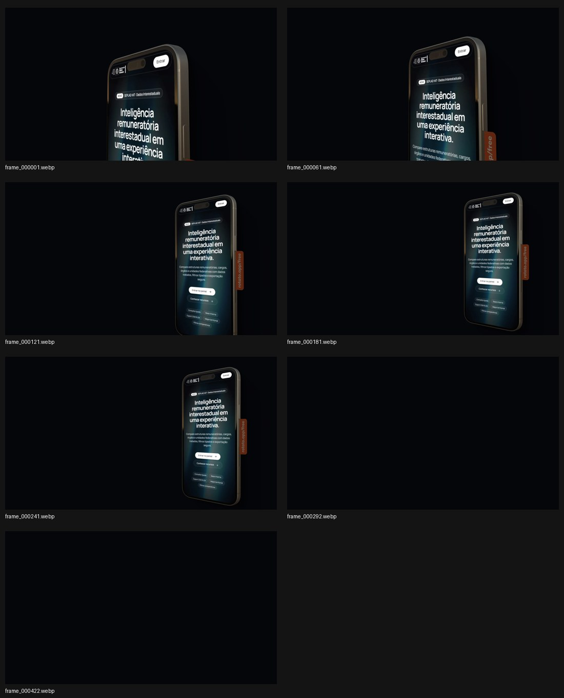

# Fontes do pedido · Processo comercial e mockup SDIMT · 03/10/2026

Arquivamento das fontes do proprietário. **Não é uma ordem de implementação.** Composição aprovada e [spec escrita](../../2026-10-04-PROCESS-BUSINESS-DESIGN.md) revisada pelo proprietário em 04/10/2026 (Cuiabá). [Plano Processo](../../2026-10-04-PROCESS-BUSINESS-IMPLEMENTATION-PLAN.md) e [plano Rotato](../../2026-10-04-SDIMT-ROTATO-IMPLEMENTATION-PLAN.md) preparados para revisão dos planos/ordem de execução. [Proposta histórica](../../2026-10-03-PROCESS-BUSINESS-PROPOSAL.md). A análise abaixo é da fonte, não evidência de reprodução em UI.

- [SVG código original](code.owner.svg): 19 paths vetoriais, viewBox 1024×1024, sem raster embutido. Ilustração isométrica em múltiplas cores/camadas. Preservar a fonte; não tratá-la como a antiga VINZ monocromática. Origem SVG Repo indicada no comentário do arquivo; URL específica/autor/licença não foram fornecidos no anexo.
- Capturas do site antigo: [descoberta](approach-phase-1.owner.png), [desenvolvimento](approach-phase-2.owner.png), [finalização](approach-phase-3.owner.png).
- Conteúdo recuperado no HEAD `7123019`: `components/Approach.tsx`, `messages/pt-br.json` e `messages/en.json`, chave `approach`. A tentativa de ler a produção pelo serviço web falhou; as fontes desta leitura são as capturas reais fornecidas e o código versionado, sem alegar navegação de produção concluída.
- [Manifesto de integridade e análise da sequência](source-manifest.json). Uploads originais não modificados.

## Rotato SDIMT existente na branch

Fonte: `public/awwwards/sdimt/motion-sdimt/frame_000001.webp` até `frame_000422.webp`. Introdução verificada em `e7b642046dfb8a529655a30be819b9d499c011eb`, preservada no HEAD `7123019a6f7a10cfabfa44958be2c337bcc08de2`. A URL do commit `7c0e70c` informada pelo proprietário retornou “No commit found” pela API nesta leitura; isso não impede consultar a sequência presente no HEAD e não justifica pedir o reenvio dos arquivos.

Verificação de todos os 422 arquivos: **2880×1620, RGB, sem alpha**, total 16.981.354 bytes, cerca de 17 MB decimais. O pixel do canto nas amostras é RGB(4,6,10). A cena foi exportada sobre fundo escuro; o fundo transparente relatado pelo proprietário não está preservado nestes arquivos. Não prometer composição transparente, nem usar blend/keying que destrua as regiões escuras do aparelho e do site.

Há 242 blobs distintos; os últimos 131 slots (`292`–`422`) têm exatamente o mesmo conteúdo. Nas amostras, o aparelho sai da cena antes dessa cauda escura. Não segurar automaticamente o último frame como mockup de fechamento; considerar o movimento original, um estado anterior de leitura e a passagem útil ao próximo conteúdo. Os originais permanecem intactos. FPS/duração de exportação não foram fornecidos e não são inferidos da contagem. As amostras também exibem a marca lateral do exportador (`rotato.app/#free`); registrar isso como característica da mídia atual antes de tratá-la como asset final.

Carregar todos como bitmaps RGBA decodificados exigiria aproximadamente 7,88 GB, sem contar overhead. Isso é cálculo de memória, não medição de browser. A integração futura deve usar cache por janela, descarte e prontidão de frames; os 17 MB codificados não representam o custo decodificado. Nenhuma implementação ou teste de reprodução da sequência foi realizado nesta etapa.
